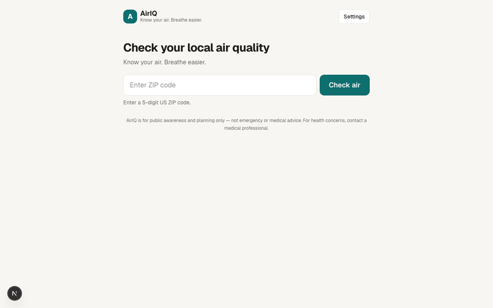

# AirIQ

**Live:** https://airiq.100dayaichallenge.com

**Know your air. Breathe easier.** A mobile-first web app that helps residents check their
local air quality by ZIP code — and understand what it actually means *for them*.

Day 23 of Savion's [100 Day AI Build Challenge](https://www.100dayaichallenge.com/share/savion).

## What it does

Enter a US ZIP code and AirIQ geocodes it, pulls live data from Google's Air Quality API, and
presents a calm, plain-English dashboard:

- **Current AQI** with category, color, dominant pollutant, and last-updated time
- **Health guidance tailored to you** — pick your group (general, children, older adults, asthma/lung,
  heart condition, pregnant, athlete/outdoor worker) and that group's advice is shown first
- **Pollutant details** — PM2.5, PM10, ozone, and more, with plain labels
- **4-day forecast** and a **24-hour trend** chart
- **Map** centered on your location, with an optional Air Quality heatmap overlay
- **Nearby support** — pharmacies, clinics, libraries, and community centers (indoor places for cleaner air)
- **Weather context** — feels-like temperature, wind, visibility, humidity
- **Tri-lingual** — English, Spanish, French (health text localized via Google)
- **Saves your location** in `localStorage` and auto-loads it next time
- **Installable PWA** with an offline app shell

Calm by design: reassuring copy when the air is good, clear and actionable warnings when it isn't,
a persistent reminder that it's for awareness and planning (not medical advice), and a wildfire/smoke
callout pointing to official local alerts.

## Screenshot



## How it's built

- **Next.js (App Router) + TypeScript + Tailwind CSS v4**
- **Server API routes proxy every Google call** so the powerful API key never reaches the browser.
  Only the Maps JavaScript key is public (and should be referrer-restricted).
- `@vis.gl/react-google-maps` for the map, `recharts` for the trend chart
- Google APIs: Geocoding, Air Quality (current / forecast / history / heatmap tiles), Places (New),
  Maps JavaScript, and Weather

### Architecture at a glance

```
app/api/*          server routes: geocode, air-quality/{current,forecast,history}, places/nearby, weather
app/page.tsx       dashboard orchestrator
components/*        ZipSearch, AQICard, HealthGuidance, PollutantBreakdown, ForecastStrip,
                   TrendChart, AirQualityMap, NearbyResources, SettingsPanel, ...
lib/*              types, aqi logic, google fetchers, storage, i18n (en/es/fr), userGroups
hooks/*            useAirQuality, useSavedLocation, useUserGroup, useLanguage, useNearby
```

## Install

```bash
git clone https://github.com/Still-InFrame/day-23-airiq.git
cd day-23-airiq
npm install
cp .env.local.example .env.local   # then paste your Google API key into both values
npm run dev
```

You need a Google Cloud project with **billing enabled** and these APIs turned on: Geocoding,
Air Quality, Places (New), Maps JavaScript, and (optionally) Weather. Put the key in `.env.local`:

```
GOOGLE_API_KEY=your_key                # server-side (all proxied calls)
NEXT_PUBLIC_GOOGLE_MAPS_KEY=your_key   # browser (Maps JS + heatmap tiles)
```

For development a single key works in both. **Before going public, split them** and restrict each in
Google Cloud: the server key by API (and IP), the browser key by HTTP referrer.

## Links

- Tracker: https://www.100dayaichallenge.com/share/savion
